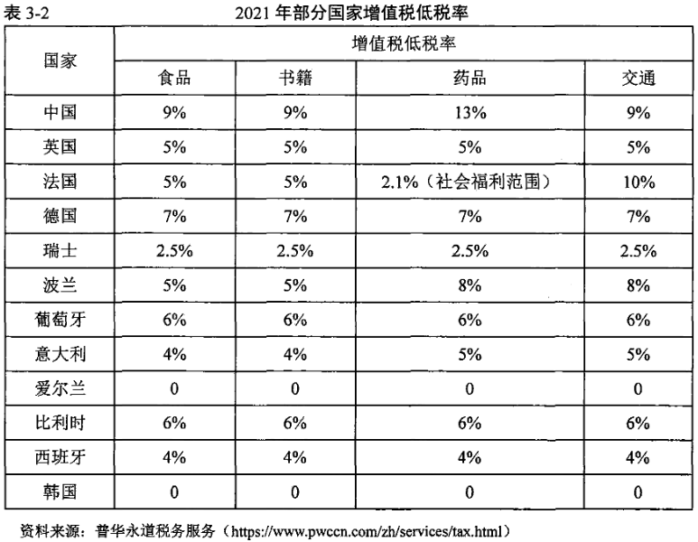

# 税收政策对居民消费的影响（收入端）

一般认为制约消费增长的主要因素是居民的消费能力、消费意愿，税收负担正是通过改变这些制约因素来达到对消费的影响。关于税收负担对居民消费的影响，西方主流消费理论指出居民的消费能力确定了消费支出的水平，而消费能力大小又主要取决于居民的收入水平。凯恩斯绝对收入理论指出人们的消费是随即期收入的变化而绝对变化，即随收入增加，消费也呈现增加。莫迪利亚尼的生命周期理论则认为人们的消费不仅取决于即期的收入，还取决于他一生的收入和财产收入，理性的消费者是根据其寿命去安排他的收入使用，从而使消费和储蓄达到合理的比例。而弗里德曼的持久收入理论指出消费其本质是持久性的消费，它和持久性收入相对应，因此人们在安排消费计划时是根据持久性收入水平来安排消费支出，所以消费是持久性收入的函数。从这些理论中我们知道消费不仅由即期收入决定，还取决于预期的收入水平，以及人们收入的积累水平（即财产），征税会影响这些收入的水平，从而带来对消费影响。

因此，消费和收入间的关系可以简单表示为C=a+by-T(其中a为初始消费支出，b为边际消费倾向，y为居民预期收入与持久收入，且边际消费倾向会随收入的增加而递减)。因此，税收机制可通过影响居民收入影响居民消费。其中影响居民消费的

> - 商品税与居民消费规模负相关，商品税占比提升将显著降低居民消费率。增值税占比每提高1%，居民消费率将下降0.161%；消费税占比每提高1%，居民消费率将下降0.11%
>
> - 实证结果表明，居民收入水平对消费结构升级有促进作用，居民收入水平提高１％带来发展和享受型比重提升0.074%的效果，这表明居民可支配收入越高，可用于消费的资源越多，生存型消费支出的占比也就越少，从而促进消费升级。

## 商品税——当前可支配收入

### 理论分析

商品税产生的税收负担对消费者选择的替代效应表现为在当政府对商品课税之后，会使课税商品的价格相对上升，消费者便增加无税商品的购买量，减少课税商品的购买量；商品税产生的税收负担对消费者选择的收入效应表现为当政府课税之后，会使消费者可支配收入下降，从而降低商品的购买量，而居于较低的消费水平上。因此，无论是从收入效应还是替代效应来分析，征收商品的消费税总体来说会降低纳税人的实际购买能力，最终都会使得消费者的消费水平下降。

因此为了减轻商品税对消费的抑制作用，应减轻商品税税负。商品税课税范围广泛，税负下降将引起商品绝对价格下降，市场整体需求会随之增加。

> 增值税政策：降低增值税税率，普惠性降低居民负担。从1994年起，我国对增值税税率进行了4次调整。2019年4月1日起，进一步将增值税率调整为13%、9%和6%三档税率。
>
> 消费税政策：降低消费税税率，缩小税基。2016年，取消对普通美容、修饰类化妆品征收消费税，将“化妆品”税目名称更名为"高档化妆品"，同时将税率由30%降低至15%。

### 现有商品税制度缺陷

- 增值税：增值税税率偏高。OECD（2014）对成员国增值税低税率的收入分配效应进行测算，发现对居民基本生活必需品实行增值税低税率时，穷人受益程度要高于富人，这一举措有利于整体上改善居民的消费结构？。然而，我国现行增值税政策仅对农产品实行９％的低税率？，对进口的抗癌药和罕见病药实行3%的优惠税率。可见，居民生活必需品的增值税税率较高，增值税对居民生活必需品的减免力度较弱，增值税优惠政策覆盖的生活必须品较少，限制居民消费总量的扩大。下表显示，发达国家大多都对食品、书籍、药品、交通等居民生活必需品征收低税率，英国、法国、德国等发达国家对居民生活必需品征收的税率大都在７％及以下，韩国和爱尔兰甚至对基本生活必需品实行零税率。由此可见，我国基本生活必需品的增值税税率较高，增加了居民的生活成本，这不仅难以防止消费降级，更不利于消费升级。

  

- 消费税：税率，税目设置不合理。一方面，随着居民生活水平的改善，金银首饰、贵重珠宝玉石等早已被列入居民日常消费清单内，而我国仍对其征收5%的消费税，这无疑会给居民的日常消费带来压力，不利于居民消费升级的实现。其次，我国在2006年将不含税价格>10000元的手表定义为高档手表并对其征收20%的消费税，随着居民消费能力的提高，再将10000元作为高档手表的课税临界点显得不合时宜。因此，在品质消费深入人心的今天，如果还给上述消费品贴上“高档”的标签征收较高的消费税，无疑会增加居民的生活成本，压抑居民追求品质消费的热情，阻碍居民消费升级目标的实现。

### 政策建议

尽管下调增值税税率有利于改善收入分配，降低居民的税收负担，但考虑到我国财政支出的压力，而且与其他实行增值税两档税率的国家相比，我国13%的标准税率水平并不高。因此，应维持现有13%的标准税率。关于增值税低税率水平的确定。万莹（2018）以及张淑翠，李建强，秦海林（2019）等认为增值税低税率设定为6%较合理。为了减弱增值税的累退性，应当将增值税低税率应设定为６%，将原适用9%的税率并入６％税率范围内。因此，增值税应确定为“一档标准税率(13%)＋—档低税率（6%）”的模式，既能削弱多档税率对企业生产和居民消费决策的扭曲性，又能减轻居民的生活负担，改善消费环境。

### 所得税——持久收入

### 理论分析

居民预期收入是由劳动供给，即居民的就业决定的。若将劳动收入和“闲暇”作为两个可供劳动者选择的商品，当政府对劳动收入征税时，就会减少劳动者投入所获得的收益，于是劳动者在劳动收入和“闲暇”两种商品间的选择会产生收入效应和替代效应。从收入效应看，由于征税使得劳动者收入减少，个人可支配收入的减少又促使其增加劳动的投入，以此弥补应征税带来的损失，居民持久收入增加；从替代效应看，政府对劳动收入的征税不仅减少了劳动的收入，而且使劳动的价格相对于“闲暇”提高，两种商品的价格变化，使得纳税人更倾向于选择价格较低的“闲暇”，从而劳动力的供给会减少，社会失业会增加，居民持久收入下降。

税收负担所带来的两种效应程度的大小取决于现实的收入水平和税制形式。当个人收入水平越高，税收负担的收入效应将小于替代效应，社会的劳动就业程度减少；反之则反。就税制形式而言，当实行累进税时，由于劳动收入增加面临更高的税率，劳动的边际收入大幅减少，人们更多的趋向于选择“闲暇”来替代劳动，累进程度越高替代效应越强。

因此从劳动供给层面上讲，降低个人所得税的累进程度，提高税前的免征额有利于实现社会的充分就业，从而促进社会消费。

### 现有制度缺陷

近年随着我国经济迅速发展和物价水平上涨速度加快，个税基本减除费用缺乏动态调整机制，全国统一的个税基本减除费用在形式上看似公平，宄其实质忽视了横向和纵向公平原则，导致政策目标与实际效果相悖，挤出居民消费。一方面，我国幅员辽阔地大物博，各地区经济发展存在差异。有测算表明，我国最高地区价格水平是最低地区价格水平的1.29倍。“一刀切”式的费用减除标准忽略了各地区居民生活成本的差异，长此以往容易导致地区间税负不公平，无法最大限度发挥个人所得税促进公平的作用。另一方面，个人所得税基本减除费用忽略了通货膨胀这一因素，据测算，2011年至2020年10年间，我国居民消费价格指数即CPI年均涨幅为2.5%，而且该指标并未将满足居民基本生活需求的住房包含进来，忽视了高房价对居民消费的巨大挤出效应。由此可见，无论是从区域视角还是时间维度来看，“一刀切”的基本减除费用缺乏随地区经济发展差异和物价水平波动进行动态调整的机制，损害中低收入人群的利益，限制个人所得税收入再分配职能的充分发挥，抑制了社会总体消费能力。

> “我国地区价差指数方法和应用研宄”课题组．我国地区间价格水平差异比较研宄ｍ．统计研宄，２０１４，３１（０４）：２２－３０．

### 政策建议

国个人所得税所谓的“基本减除费用”，实际上是对居民纳税人及其负担人口的基本生计和其他必要生活费用的扣除，其设计初衷是保障居民的基本生活消费，促进社会公平。然而，当前我国个人所得税基本减除费用采取固定数额的形式，灵活性较差。由于各地区经济状况的差异和物价水平不断上涨的现实因素，应结合社会发展实际情况，建立个税基本减除费用的动态调整机制。一方面，个税基本减除费用应考虑地区经济发展差异性，基于社会总体消费水平确定费用扣除标准的可行区间，然后允许各地区根据居民的生活成本差异在可行范围内动态调整费用扣除标准，以此保障中低收入人群的基本利益，进而提升其高层次的消费需求。另一方面，个人所得税基本减除费用与居民基本生活密切相关，应该随着居民消费价格指数（CPI）的变化进行动态调整，减少宏观经济波动对居民税负水平的影响，从而有效避免可能因通货膨胀带来的居民实际可支配收入的下降，保障居民的消费需求不会因物价上涨而减少。

---

## 消费意愿

即期可支配收入是消费支出的上限，在这一收入水平下，消费者如何安排消费和储蓄的比例取决于他的消费意愿，而消费意愿由边际消费倾向所决定。

### 所得税——调节贫富差距

个人所得税的基本费用减除、专项附加扣除以及累进税率等税制设计体现了“量能负担”的原则，有利于缩小贫富差距。具体来说，累进税率可以实现对高收入者的调节作用，费用扣除标准给予了低收入者税收优惠。穷人的边际消费倾向高于富人，个人所得税费用扣除政策有利于增加中低收入群体的实际收入；边际税率的提高的有利于限制高收入群体的收入，提高税制累进性，体现公平性。通过发挥个人所得税改善收入分配状况的功能，贫富差距得以缩小，社会整体的消费倾向得以提高，从而促进居民消费。

> 提高个税基本减除费用：税基本减除费用的设计主要是为了抵消税收对居民基本生计的影响。１９８０年我国个税基本减除费用为８００元／月，在２００６年、２００８年和２０１１年，先后提高至１６００元声月、２０００元／月、３５００元每月；自２０１８年１０月１日起，将个税基本减除费用提升至５０００元／月。个税基本减除费用的４次调整旨在调整居民收入分配，增加中低收入群体居民的可支配收入，新增的收入会以一定的比例用于消费支出。
>
> 增设专项附加扣除项目：２０１８年个税改革首次增设了专项附加扣除项目，包括子女教育、继续教育、赡养老人、大病医疗、住房租金以及住房贷款６项。专项附加扣除的设置考虑了不同群体的生活负担和诉求，切实增加了居民可配收入，体现了政府保障改善民生、提升消费的政策导向。

### 财产税

### 税收负担对居民消费能力的影响

1. **增加居民可支配收入**

   个人所得税是调节居民收入分配最直接、最有利的工具，通过降低个人所得税，可以直接增加居民可支配收入。提高个税基本费用减除、增设专项附加扣除等政策的实施，有利于增加居民的可支配收入，居民新增的收入会以一定的比例用于居民消费的増加

   - 提高个税基本减除费用。个税基本减除费用的设计主要是为了抵消税收对居民基本生计的影响。１９８０年我国个税基本减除费用为８００元／月，在２００６年、２００８年和２０１１年，先后提高至１６００元声月、２０００元／月、３５００元每月；自２０１８年１０月１日起，将个税基本减除费用提升至５０００元／月。个税基本减除费用的４次调整旨在调整居民收入分配，增加中低收入群体居民的可支配收入，新增的收入会以一定的比例用于消费支出。
   - 增设专项附加扣除项目。２０１８年个税改革首次增设了专项附加扣除项目，包括子女教育、继续教育、赡养老人、大病医疗、住房租金以及住房贷款６项。专项附加扣除的设置考虑了不同群体的生活负担和诉求，切实增加了居民可配收入，体现了政府保障改善民生、提升消费的政策导向。

2. **缩小居民收入差距**

   个人所得税的基本费用减除、专项附加扣除以及累进税率等税制设计体现了“量能负担”的原则，有利于缩小贫富差距。具体来说，累进税率可以实现对高收入者的调节作用，费用扣除标准给予了低收入者税收优惠。穷人的边际消费倾向高于富人，个人所得税费用扣除政策有利于增加中低收入群体的实际收入；边际税率的提高的有利于限制高收入群体的收入，提高税制累进性，体现公平性。通过发挥个人所得税改善收入分配状况的功能，贫富差距得以缩小，社会整体的消费倾向得以提高，从而促进居民消费

   - 合理调整累进税率档次，优化累进税率结构。２０１１年我国对个人所得税税率进行调整，将９级超额累进税率简化为７级，取消１５％和４０％两档税率；同时将最低档税率由５％调低至３%，并扩大３％和１０％两档低税率的级距。2018年个税改革扩大了3％、10％和20％三档税率的级距，缩小了２５％税率的级距。个税税率的调整极大降低了中低收入阶层的税负水平，使高收入群体承担更多的税负，体现“量能负担”原则，有利于公平不同收入群体的税负。
   - 个人所得税逐步转向综合征收。２０１８年个税改革对工资薪金、劳务报酬、稿酬、特许权使用费采用综合计税的方式，逐步建立起综合与分类相结合的个人所得税制，有利于公平不同性质收入的税负。

### 财产保有阶段

在财产保有阶段，财产税通过对居民的房产、遗产等财富存量等进行调节，从而公平财富分配。

财产税作为税制体系的重要组成部分，对居民财富存量进行调节，公平财富分配。对居民个人来说，目前我国的财产税主要体现为对房屋的调整。

以房产税为例，自２０１１年１月２８日起，在上海和重庆开展房产税试点工